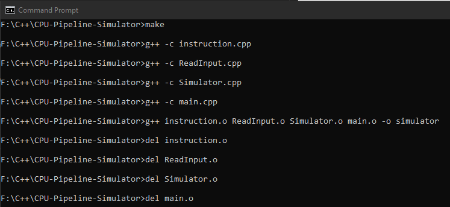
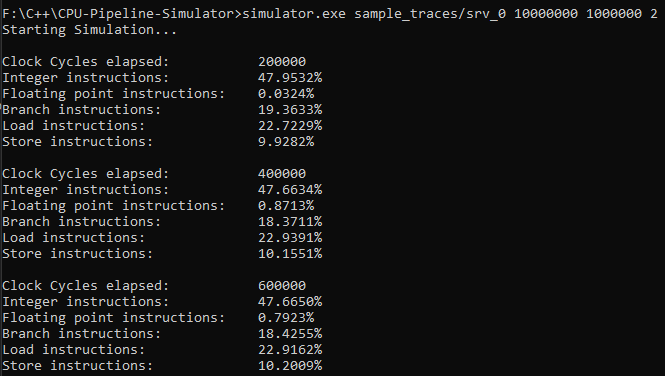
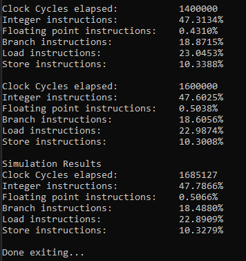

# CPU Pipeline Simulator
Simulate CPU pipeline based on different workloads and generate some metrics.

## Simulator Assumptions
- No branch prediction
- All instruction fetches hit in the L1 instruction cache and don’t need to read from memory
- All memory operations (loads and stores) hit in the L1 data cache and don’t need to read/write from/to memory.
- Integer and floating point operations execute in 1 cycle.
- Any branch instruction delays instruction fetch until after the branch executes. The next instruction(s) to be fetched will go to the IF stage in the cycle after the branch finishes the EX stage.
- All loads and stores access the L1 data cache in 1 cycle.

## Trace Format

1. Instruction program counter (PC): A hexadecimal value representing the instruction address.
2. Instruction type: A value between 1 and 5:
    1. Integer instruction: An instruction that uses the integer ALU
    2. Floating point instruction: An instruction that uses the floating point unit
    3. Branch: An instruction that transfers control to the next instruction in the trace.
    4. Load: An instruction that reads a value from memory.
    5. Store: An instruction that writes a value to memory.
3. A list of PC values for instructions that the current instruction depends on (up to 4)

### Example
Example traces included

## Experimental Design
- Measure impact of pipeline width (1 through 4) and workload trace.

## Running the Simulator
1. Unzip the sample trace files.
2. Run the ```.bat``` file as follows: ```make```
This will generate the executable.
3. Run the simulator with desired parameters.
    Example: ```simulator.exe sample_traces/srv_0 10000000 1000000 2```

### Simulator Parameters
1. executable
2. trace_file_name
3. starting_instruction_number
4. number_of_instructions
5. pipeline_width

## Generated Metrics
- Total execution time (in cycles) at the end of simulation.
- A histogram containing the breakdown of retired instructions by instruction type.

## Sample Output
1. Running the make script


2. Running the simulator


3. Tail of the output


## License
- This project was built as a part of CMPT305 \- Modelling and Simulation Spring 2023.
- Trace files were provided as course material by instructor Dr Alaa Alameldeen
- Parts of this documentation (some verbatim) are also taken from course project description by instructor Dr. Alaa Alameldeen
